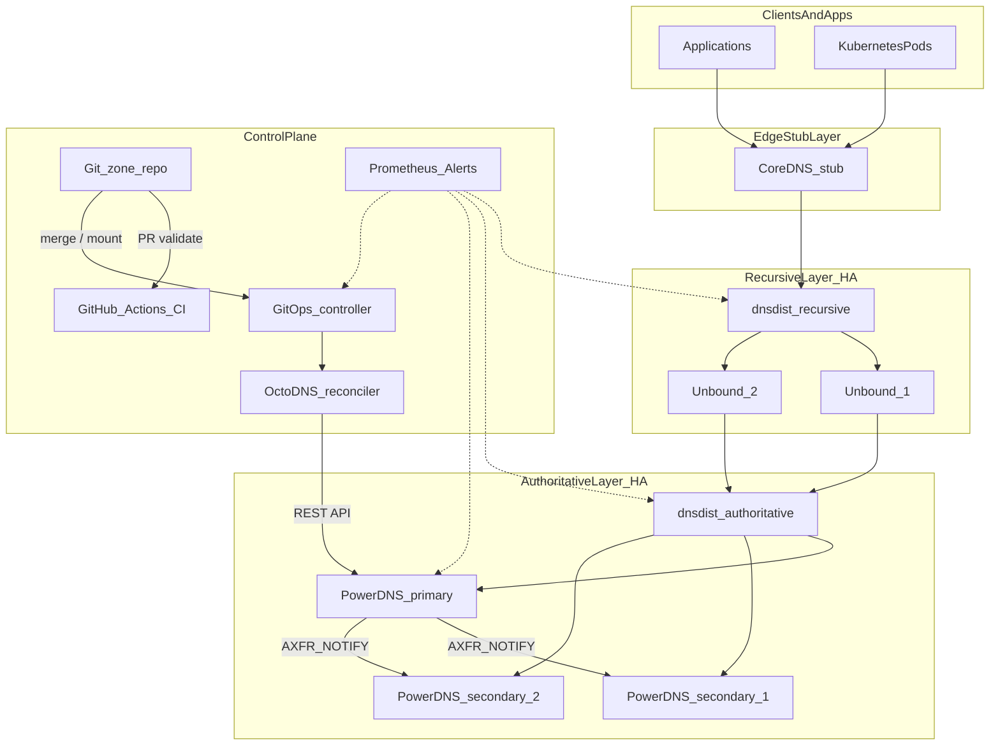
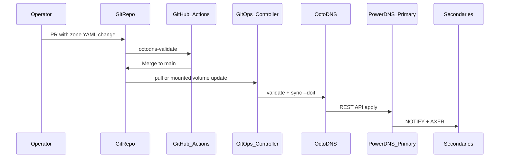

# Robust DNS Reference Architecture

This document describes the reference internet-scale DNS stack implemented in this repository. It separates authoritative and recursive roles, eliminates single points of failure at each layer, adds DNSSEC and observability, and manages zones via GitOps.

## Design principles

1. **Strict role separation** — Authoritative servers never recurse; recursive resolvers never host public zones (ICANN/BIND BCP).
2. **N+1 minimum** — One primary + two secondaries behind dnsdist; two or more Unbound instances behind a separate dnsdist.
3. **Single source of truth** — Git (`zones/`) → OctoDNS → PowerDNS primary → AXFR to secondaries.
4. **DNSSEC by default** — All reference public zones are signed; unsigned answers are refused by validating resolvers.
5. **Defense in depth** — TSIG for zone transfers, dnsdist ACLs and rate limits, no open recursion.
6. **Observability first** — Every layer exports Prometheus metrics; alerts fire on SLO burn.

## Layered topology

## Component roles

| Layer | Software | Role |
|-------|----------|------|
| Authoritative primary | PowerDNS + PostgreSQL | Zone serving, REST API, AXFR/NOTIFY source |
| Authoritative secondaries | PowerDNS (×2) | Read-only replicas via AXFR |
| Auth front-end | dnsdist | Health checks, ACLs, rate limiting, failover |
| Recursive resolvers | Unbound (×2+) | DNSSEC-validating recursion only |
| Recursive front-end | dnsdist | Pool Unbound backends, ACL enforcement |
| Platform stub | CoreDNS | Forward-only stub to recursive VIP |
| Zone GitOps | GitOps controller + OctoDNS | Continuous reconcile; Git → PowerDNS API |
| CI validation | GitHub Actions | PR gate: `octodns-validate` |
| Observability | Prometheus, Grafana, blackbox_exporter | SLI collection and alerting |

## Data flow: zone publication

### GitOps controller service

The `gitops-controller` container (`robust-dns-gitops`) is part of the control plane:

| Capability | Detail |
|------------|--------|
| Reconcile loop | Polls every `GITOPS_SYNC_INTERVAL` (default 60s) |
| Drift detection | Dry-run diff; applies when Git ≠ PowerDNS |
| Webhook | `POST /sync` on port 8088 triggers immediate reconcile |
| Git remote | Optional `GIT_REPO_URL` for production; lab uses mounted `zones/` |
| Health | `GET /health`, `GET /ready` on port 8088 |

See [zone GitOps runbook](runbooks/zone-gitops.md) for operator procedures.

## Role separation rules

### Authoritative tier (PowerDNS)

- `recursor=no` — no recursion
- Primary holds the only writable copy (PostgreSQL backend)
- Secondaries are AXFR-only; no direct zone edits in production
- DNSSEC signing enabled on reference zones

### Recursive tier (Unbound)

- No authoritative zone files for public names
- `val-permissive-mode: no` — strict DNSSEC validation
- Split-horizon: internal zones (`*.5g-deployment.lab`) forwarded to auth dnsdist VIP
- All other queries recurse to the internet with validation

### dnsdist instances

Two separate dnsdist processes (never combined):

| Instance | Backends | Clients |
|----------|----------|---------|
| dnsdist-auth | PowerDNS primary + secondaries | Unbound forwarders, monitoring |
| dnsdist-recursive | Unbound pool | Internal clients, CoreDNS, lab hosts |

## Reference zones

This lab mirrors existing 5G deployment zones for before/after comparison:

| Zone | Purpose |
|------|---------|
| `infra.5g-deployment.lab` | Infrastructure records |
| `api.hub.5g-deployment.lab` | API hub records |

NS records point at the auth dnsdist VIP (`AUTH_VIP` in `.env`), not a single BIND pod.

## Comparison: before vs after

| Pattern | Before (lab anti-patterns) | After (this stack) |
|---------|---------------------------|-------------------|
| Instance count | Single dnsmasq or BIND replica | Primary + 2 secondaries + pooled Unbound |
| Role mixing | dnsmasq: DHCP + DNS + forward | Strict auth/recursive separation |
| HA / failover | None (`replicas: 1`) | dnsdist health checks + firstAvailable |
| Zone management | Static files, manual edits | Git → OctoDNS → API |
| Update policy | `allow-update { any; }` | TSIG-authenticated AXFR only |
| DNSSEC | None | Signed zones, validating resolvers |
| Client hacks | forcedns rewrites resolv.conf | DHCP option 6 + CoreDNS forward |
| Observability | None | Prometheus + blackbox + chaos tests |

## Network layout (Compose lab)

The Podman Compose stack simulates multi-tier separation with isolated networks:

| Network | CIDR | Services |
|---------|------|----------|
| control_net | 10.89.1.0/24 | PostgreSQL, GitOps controller, OctoDNS, Prometheus, Grafana |
| auth_net | 10.89.2.0/24 | PowerDNS ×3, dnsdist-auth |
| recursive_net | 10.89.3.0/24 | Unbound ×2, dnsdist-recursive, CoreDNS |

Published host ports:

| Port | Service |
|------|---------|
| 53/udp,tcp | dnsdist-recursive (client-facing) |
| 5300/udp,tcp | dnsdist-auth (internal) |
| 9090/tcp | Prometheus |
| 3000/tcp | Grafana |

## v2 extensions (optional profiles)

| v1 non-goal | v2 delivery |
|-------------|-------------|
| Custom resolver code | dnsdist Lua policies + Unbound views ([ADR 001](adr/001-custom-resolver-policy-vs-protocol.md)) |
| Combined dnsmasq-style | `edge` profile — forward + overrides only ([runbook](runbooks/dnsmasq-edge-migration.md)) |
| Multi-master authoritative | `ha` (PG replica + standby) and `dual-primary` profiles |
| Anycast / multi-PoP | `anycast` overlay + [anycast-bgp.md](scale-out/anycast-bgp.md), [lab fallback](scale-out/anycast-lab-fallback.md) |

Git remains the single write source of truth. Passive primaries and PoP secondaries receive AXFR from the active primary.

## Explicit non-goals (unchanged)

- Custom DNS wire-protocol / full resolver rewrite
- Concurrent multi-writer without Git lock
- Production authoritative zones on dnsmasq
- ISP-scale anycast DDoS absorption

## Related documents

- [Reliability model and SLOs](reliability-model.md)
- [Threat model](threat-model.md)
- [Zone GitOps runbook](runbooks/zone-gitops.md)
- [DNSSEC key rollover runbook](runbooks/dnssec-rollover.md)
- [Replace forcedns runbook](runbooks/replace-forcedns.md)
