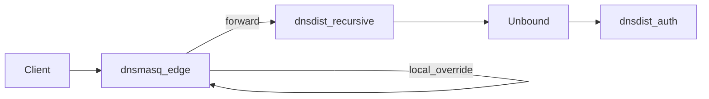

# dnsmasq Edge Migration Runbook

Migrate small sites or lab guests from a monolithic dnsmasq (DHCP + DNS + local overrides) to the reference stack without running production authoritative zones on dnsmasq.

## Target architecture



| Role | v1 monolith | v2 edge profile |
|------|-------------|-----------------|
| Local overrides | `/etc/hosts` or `address=` | Generated from `zones/` + `edge-local.robust-dns.lab` |
| Recursion | Built-in forwarder | Forwards to dnsdist-recursive VIP (`10.89.3.10`) |
| Authoritative zones | Often served locally | **PowerDNS only** — edge does not sign or AXFR |
| DHCP | Optional on same host | Optional sub-profile `edge-dhcp` |

## Enable edge profile

```bash
cd deploy/compose
./scripts/generate-dnsmasq-hosts.sh
podman-compose --profile edge up -d
```

With DHCP (lab only):

```bash
podman-compose --profile edge --profile edge-dhcp up -d
```

Edge listens at `10.89.3.50` on `recursive_net`. Host port **5355** maps to container 53.

## Migration steps

1. Deploy the v1 core stack (`podman-compose up -d` + bootstrap).
2. Generate edge hosts: `./scripts/generate-dnsmasq-hosts.sh`.
3. Start `--profile edge`.
4. Point clients at edge IP (`10.89.3.50` in lab) instead of monolithic dnsmasq.
5. Remove combined auth+recurse config from old dnsmasq; keep only overrides that are **not** in Git zones.
6. Re-run smoke: `../../tests/smoke/edge-dnsmasq.sh`.

## Verification

```bash
# Local override (edge-only name)
dig @127.0.0.1 -p 5356 edge-local.robust-dns.lab A +short
# Expected: 10.89.3.99

# Forwarded recursion
dig @127.0.0.1 -p 5356 ns1.infra.5g-deployment.lab A +short
# Expected: 10.89.2.10
```

## What not to do

- Do not serve signed production zones solely from dnsmasq.
- Do not disable the PowerDNS authoritative tier when using edge.
- Do not use edge as a replacement for GitOps zone management.

## Rollback

Stop edge profile and point clients back to recursive VIP (`5354` / `10.89.3.10`) directly:

```bash
podman-compose --profile edge stop dnsmasq-edge
```
