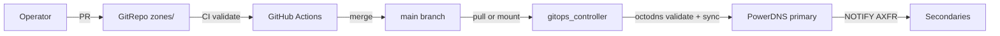

# Zone GitOps Runbook

This runbook describes how to manage DNS zones through Git in the Robust DNS reference stack.

## Architecture



The **GitOps controller** (`gitops-controller` service) is the runtime reconciler. It:

1. Reads zone YAML from a Git remote **or** a mounted `zones/` directory (lab default)
2. Validates with `octodns-validate`
3. Applies with `octodns-sync --doit` to the PowerDNS primary API
4. Triggers NOTIFY so secondaries pick up changes

**Single write path:** only the GitOps controller (or manual one-shot `octodns-sync`) writes to PowerDNS. Never edit zones on servers directly.

## Source of truth

| Path | Purpose |
|------|---------|
| [`zones/`](../zones/) | OctoDNS YAML zone files |
| [`octodns/config.yaml`](../octodns/config.yaml) | Zone → provider mapping (local/CI) |
| [`octodns/config-compose.yaml`](../octodns/config-compose.yaml) | Same config for Compose (`/zones` mount) |

### Zone file format

Example [`zones/infra.5g-deployment.lab.yaml`](../zones/infra.5g-deployment.lab.yaml):

```yaml
---
'':
  ttl: 3600
  type: NS
  values:
    - ns1.infra.5g-deployment.lab.
ns1:
  ttl: 3600
  type: A
  values:
    - 10.89.2.10
```

Rules:

- **Do not define SOA in Git** — PowerDNS manages SOA serials (`default-soa-edit=INCREMENT`).
- NS records should point at the auth dnsdist VIP (`AUTH_VIP` in `.env`, default `10.89.2.10`).
- Use trailing dots for FQDNs in `values` where required by OctoDNS.

## Standard change workflow

### 1. Create a branch and edit zones

```bash
git checkout -b add-api-record
$EDITOR zones/infra.5g-deployment.lab.yaml
```

### 2. Validate locally

```bash
pip install -r octodns/requirements.txt
octodns-validate --config-file octodns/config.yaml
octodns-sync --config-file octodns/config.yaml   # dry-run preview
```

### 3. Open a pull request

CI (`.github/workflows/octodns.yml`) runs `octodns-validate` on every PR touching `zones/` or `octodns/`.

### 4. Merge to main

After merge:

- **Lab with GitOps controller running:** changes under `zones/` are picked up within `GITOPS_SYNC_INTERVAL` (default 60s), or immediately via webhook (see below).
- **Manual apply:** run one-shot sync:
  ```bash
  cd deploy/compose
  podman-compose --profile tools run --rm \
    -e PDNS_API_KEY="$PDNS_API_KEY" \
    octodns-sync --config-file /octodns/config.yaml --doit
  ```

### 5. Verify propagation

```bash
./tests/smoke/run.sh
dig @127.0.0.1 -p 5300 +norecurse ns1.infra.5g-deployment.lab A
# Compare SOA serial across backends (should match within 60s)
dig @127.0.0.1 -p 5300 +norecurse infra.5g-deployment.lab SOA
```

## GitOps controller service

The `gitops-controller` container runs continuously in the Compose stack.

| Variable | Default | Description |
|----------|---------|-------------|
| `GITOPS_SYNC_INTERVAL` | `60` | Reconcile poll interval (seconds) |
| `GITOPS_AUTO_APPLY` | `true` | Apply changes (`false` = dry-run only) |
| `GIT_REPO_URL` | _(empty)_ | Remote Git URL; empty = use mounted `zones/` |
| `GIT_BRANCH` | `main` | Branch to track |
| `GITOPS_WEBHOOK_ENABLED` | `true` | Enable POST `/sync` webhook |
| `GITOPS_WEBHOOK_PORT` | `8088` | Webhook listen port |
| `GITOPS_WEBHOOK_TOKEN` | _(empty)_ | Bearer token for webhook auth (recommended in prod) |

### Lab mode (mounted zones)

With `GIT_REPO_URL` unset, edit files in `zones/` on the host. The controller detects drift on each interval and reconciles.

Trigger immediate sync via webhook:

```bash
curl -X POST http://127.0.0.1:8088/sync \
  -H "Authorization: Bearer ${GITOPS_WEBHOOK_TOKEN}"
```

Health checks:

```bash
curl http://127.0.0.1:8088/health
curl http://127.0.0.1:8088/ready
```

### Production mode (remote Git)

Set in `.env`:

```ini
GIT_REPO_URL=https://github.com/your-org/robust-dns.git
GIT_BRANCH=main
GITOPS_WEBHOOK_TOKEN=your-secret-token
```

The controller clones/pulls before each reconcile. Wire your CI to POST `/sync` after merge, or rely on polling.

## Adding a new zone

1. Create `zones/myzone.example.yaml`.
2. Register in `octodns/config.yaml` and `octodns/config-compose.yaml`:
   ```yaml
   myzone.example.:
     sources: [config]
     targets: [powerdns]
   ```
3. PR → merge → GitOps reconciles.
4. **First-time secondary setup** (run once per zone):
   ```bash
   podman exec robust-dns-pdns-secondary-1 \
     pdnsutil create-secondary-zone myzone.example 10.89.2.11
   podman exec robust-dns-pdns-secondary-2 \
     pdnsutil create-secondary-zone myzone.example 10.89.2.11
   ```
5. Enable DNSSEC (if required):
   ```bash
   podman exec robust-dns-pdns-primary pdnsutil secure-zone myzone.example
   ```

Or re-run [`deploy/compose/scripts/bootstrap-zones.sh`](../../deploy/compose/scripts/bootstrap-zones.sh) for full bootstrap (includes DNSSEC for reference zones).

## Rollback

```bash
git revert <commit-sha>
git push origin main
# GitOps controller applies reverted state on next sync, or:
curl -X POST http://127.0.0.1:8088/sync -H "Authorization: Bearer $TOKEN"
```

OctoDNS computes a diff — removed records are deleted from PowerDNS.

## DNSSEC considerations

- Initial signing: `pdnsutil secure-zone <zone>` (automated in bootstrap)
- Zone record changes via GitOps do **not** require re-signing — PowerDNS re-signs automatically when `gpgsql-dnssec=yes`
- Key rollover: see [dnssec-rollover.md](dnssec-rollover.md)

## Anti-patterns (do not use)

| Anti-pattern | Why |
|--------------|-----|
| `allow-update { any; }` | Zone hijacking risk |
| Manual API/UI edits on PowerDNS | Drift from Git |
| Editing secondary zone files | Secondaries are AXFR-only |
| Skipping CI validation | Bad YAML can break apply |

## Troubleshooting

| Symptom | Check |
|---------|-------|
| Changes not appearing | `podman logs robust-dns-gitops`; webhook `/ready`; SOA serial on primary |
| Validation fails | `octodns-validate --config-file octodns/config.yaml` locally |
| Secondaries stale | `pdnsutil list-all-zones` on secondary; run NOTIFY or bootstrap |
| GitOps not starting | PowerDNS API up? `PDNS_API_KEY` in `.env`? |

## Related documents

- [Architecture](../architecture.md) — control plane overview
- [DNSSEC rollover](dnssec-rollover.md)
- [Reliability model](../reliability-model.md) — propagation SLO (< 60s)
