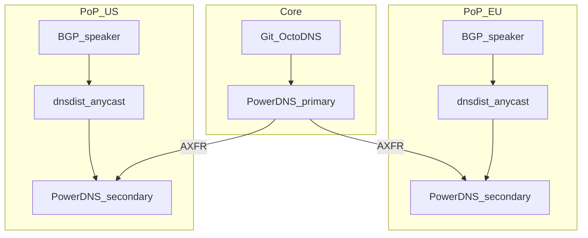

# Anycast and Multi-PoP Scale-Out

This document describes the phase-2 path for geographic distribution. **Not implemented in v1** — documented for production planning per ISC guidance.

## When to adopt anycast

- Multiple points of presence serving the same DNS anycast IP
- Sub-10ms client latency requirements across regions
- DDoS absorption at edge via distributed dnsdist instances

## Architecture

## Components

| Component | Role |
|-----------|------|
| BGP speaker (BIRD, FRR) | Announce anycast `/32` or `/128` from each PoP |
| dnsdist | Same config at each PoP; health-check local backends |
| PowerDNS secondaries | One or more per PoP; AXFR from central primary |
| Primary | Single write path remains Git → OctoDNS → primary |

## Operational notes

- Use consistent TSIG keys across PoPs (secrets management)
- Monitor per-PoP blackbox probes; withdraw BGP route on PoP failure
- DNSSEC: same zone data everywhere; KSK rollover must propagate before DS change at parent

## References

- ISC BIND anycast best practices
- RFC 4786 — DNS anycast considerations
