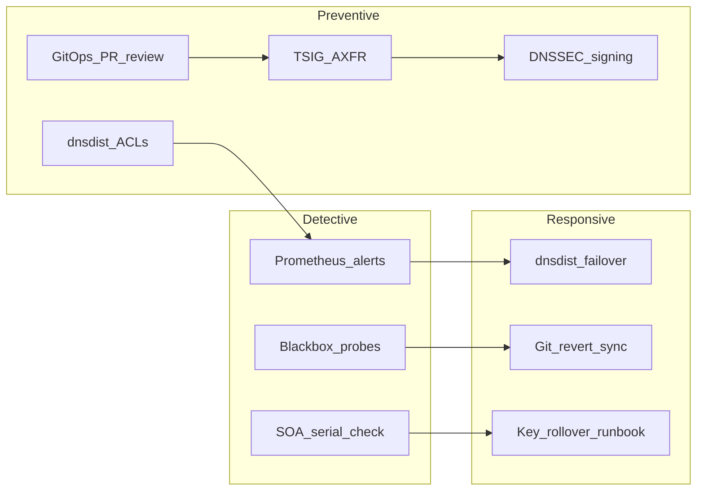

# Threat Model

This document identifies DNS-specific threats relevant to the reference stack and the controls implemented in v1.

## Scope

- Authoritative tier: PowerDNS primary + secondaries, dnsdist-auth
- Recursive tier: Unbound pool, dnsdist-recursive
- Control plane: Git zones, OctoDNS CI, PostgreSQL
- Lab reference zones: `infra.5g-deployment.lab`, `api.hub.5g-deployment.lab`

Out of scope for v1: anycast edge DDoS at ISP scale, physical site compromise, HSM-backed key storage.

## Assets

| Asset | Value | Location |
|-------|-------|----------|
| Zone data | Integrity and availability of DNS records | PostgreSQL, secondaries, Git |
| DNSSEC keys | Proof of authenticity for signed zones | PowerDNS cryptokeys table |
| TSIG secrets | Authenticate AXFR/NOTIFY | `.env`, PowerDNS config |
| PowerDNS API key | Zone modification via API | `.env`, OctoDNS |
| Resolver trust | Clients depend on correct answers | Unbound validation chain |

## Threat catalog

### T1: Unauthorized zone modification

**Example:** BIND `allow-update { any; }` allows any client to push dynamic updates.

**Impact:** Zone hijacking, traffic redirection, service outage.

**Controls:**
- No dynamic updates in production; zones changed only via Git → OctoDNS → API
- PowerDNS API key restricted to control network
- TSIG required for AXFR/NOTIFY (no unsigned transfers)
- OctoDNS CI validates syntax before apply

### T2: Zone transfer exfiltration

**Example:** Attacker initiates AXFR from an authoritative server.

**Impact:** Full zone enumeration, aid reconnaissance.

**Controls:**
- TSIG-authenticated AXFR (`allow-axfr-from` with key name)
- dnsdist ACL limits who can query auth tier
- Secondaries accept NOTIFY only from primary IP with TSIG

### T3: Cache poisoning (recursive)

**Example:** Attacker injects forged answers into resolver cache.

**Impact:** Clients reach attacker-controlled endpoints.

**Controls:**
- Unbound strict DNSSEC validation (`val-permissive-mode: no`)
- `harden-dnssec-stripped: yes` — reject answers with RRSIG stripped
- No open recursion; ACL restricts clients to lab CIDRs

### T4: DNS amplification / reflection DDoS

**Example:** Open resolver used to amplify traffic toward a victim.

**Impact:** Network saturation, resolver overload.

**Controls:**
- Recursion restricted by dnsdist and Unbound ACLs
- dnsdist rate limiting per source subnet
- No open recursion to `0.0.0.0/0`

### T5: TSIG / API key compromise

**Example:** Leaked `.env` file with TSIG secret or API key.

**Impact:** Unauthorized zone transfers or zone edits.

**Controls:**
- Secrets in `.env` (gitignored); `.env.example` has placeholders only
- Production path: Vault or Kubernetes Secrets (documented in deploy guides)
- Key rotation runbook in [dnssec-rollover.md](runbooks/dnssec-rollover.md)

### T6: DNSSEC key compromise or expiry

**Example:** ZSK leaked, or KSK not rolled before expiry.

**Impact:** Forged signatures possible (if KSK leaked); validation failures (if expired).

**Controls:**
- Automated signing in PowerDNS for reference zones
- KSK/ZSK rollover documented in runbook
- Alerts on validation failure rate (`DNSSECValidationFailure`)

### T7: Denial of service on authoritative tier

**Example:** High-volume queries against auth servers.

**Impact:** Legitimate queries dropped or delayed.

**Controls:**
- dnsdist rate limiting and dynamic blocks
- Separate auth and recursive dnsdist instances (recursive load cannot starve auth)
- Future: RPZ for known-bad domains (stub in config comments)

### T8: Supply chain / bad zone publish

**Example:** Malicious or typo'd record merged to main.

**Impact:** Wrong answers served globally for affected names.

**Controls:**
- PR-based GitOps with OctoDNS validate on every PR
- Dry-run before apply
- Rollback: revert Git commit and re-sync

## Control summary

## Residual risks (v1)

| Risk | Severity | Mitigation path |
|------|----------|-----------------|
| Single-host Compose lab | Medium | Document as reference; production uses multi-node Ansible/K8s |
| No HSM for DNSSEC keys | Low (lab) | Production: PKCS#11 or cloud KMS |
| No DoT/DoH on client edge | Low | dnsdist supports DoT/DoH; enable in phase 2 scale-out |
| RPZ not fully wired | Low | Stub config; enable feed in v1.1 |

## References

- ICANN KSK rollover guidance
- ISC BIND best current practices (auth/recursive separation)
- RFC 9615 — DNSSEC automation considerations
